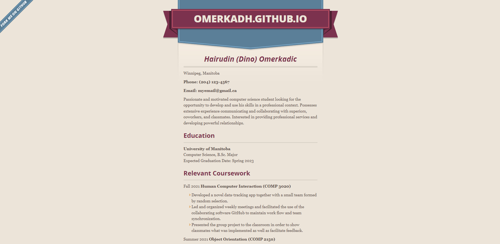
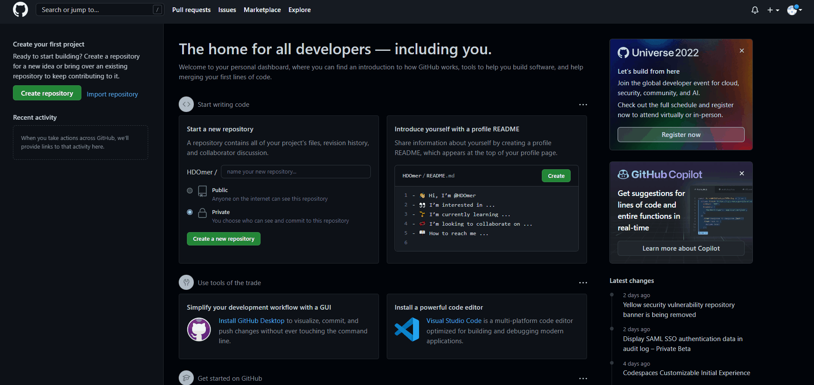
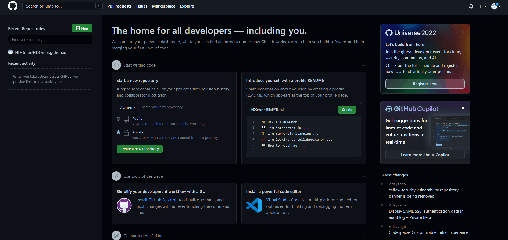
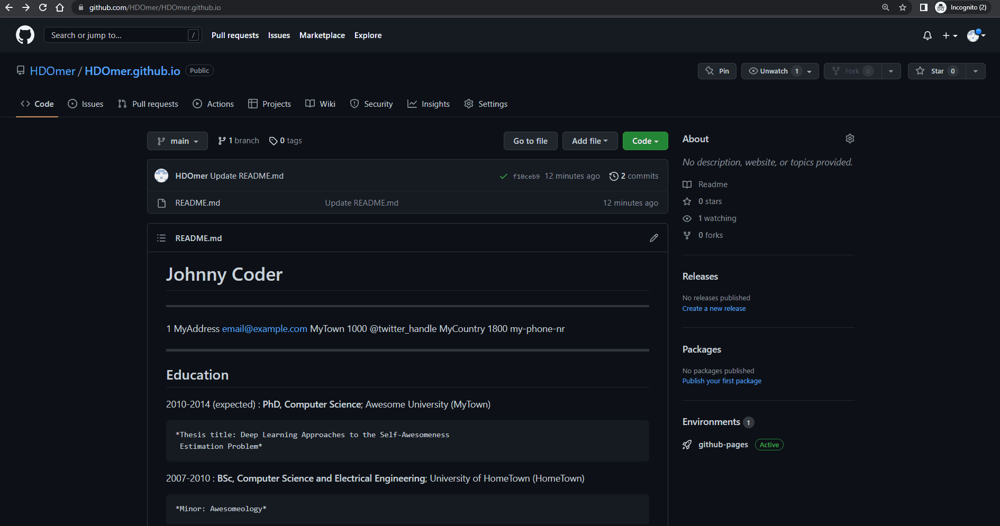

# Hosting a Resume on GitHub Pages

  
_My resume as a sample._

## Purpose

In this README you will learn how to host and format an online resume using: [Markdown](https://www.markdownguide.org/getting-started/), a [text editor](https://code.visualstudio.com/), [GitHub](https://github.com/), [GitHub Pages](https://pages.github.com/), and (minimally) [Jekyll](https://jekyllrb.com/docs/). You will learn a little bit about these tools and how they relate to principles of modern technical writing outlined in Andrew Etter's book, _Modern Technical Writing_.

## Prerequisites

You will need:  

- A resume formatted in [Markdown](https://daringfireball.net/projects/markdown/).  
NOTE: Take a look at [this](https://www.markdownguide.org/cheat-sheet) cheat sheet and navigate [here](https://www.markdowntutorial.com/) for an interactive tutorial.
- A GitHub account.  
NOTE: follow [this](https://github.com/) link to GitHub and click _sign up_.

## Instructions

The following instructions are based on the GitHub Pages [quick start](https://docs.github.com/en/pages/quickstart) guide.

### Step 1. Create a [Repository](https://docs.github.com/en/repositories/creating-and-managing-repositories/about-repositories)

Begin from your _personal dashboard_, the first page you see after logging in.  

1. Click the _plus_ (+) icon next the the _bell_ in the top right corner of the dashboard.
2. Click _New repository_.
3. Enter `YourUsername.github.io` under _Repository name_, replacing _YourUsername_ with the username for your GitHub account.  
NOTE: This specific naming scheme is _required_.  
NOTE: Ensure _Public_ is selected, not _Private_.
4. Scroll down.
5. Click the green _Create repository_ button.  
RESULT: You will see a sort of quick setup page.
6. Click the hyperlink labeled _README_. It is located under and to the right of the _Quick setup_ heading, in the same rectangular section.  
NOTE: This `README.md` file is where you will paste your resume.
7. Scroll down to the bottom of the page.
8. Click _Commit new file_.  

  
_An illustration of Step 1._

An important suggestion by Andrew is use a [distributed version control system](https://en.wikipedia.org/wiki/Distributed_version_control) (DVCS). Often, not using a DVCS is a wasted opportunity. Almost every large software company uses some kind of DVCS, so a technical writer that refuses to follow suit is not a good look. Additionally, since most of the software a writer is documenting will itself be using a DVCS, using a DVCS for documentation presents the opportunity to keep code and documentation close together. As the code progresses, so too can the documentation.

### Step 2. Copy your Markdown formatted resume into a `README.md` file

The `README.md` file will automatically be recognized by GitHub and used to populate your website. To start, you should be viewing the _Code_ tab within your repository.

1. Click on _README.md_.  
RESULT: You should see a preview of the README file.
2. Click the pencil icon above the preview to edit the file.
3. Type or paste your Markdown formatted resume in the text box.
4. Scroll to the bottom of the page.
5. Click "_Commit changes_".

  
_An illustration of Step 2._

As Andrew says in his book, [lightweight markup languages](https://en.wikipedia.org/wiki/Lightweight_markup_language) such as Markdown are essential for a technical writer. Compared to a document in [XML](https://www.w3.org/standards/xml/core#:~:text=What%20is%20XML%3F,more%20suitable%20for%20Web%20use.), which is not a lightweight markup language (but still a markup language), the same document in Markdown would likely have half the amount of text, be much easier to read, and be much easier to write. Furthermore, Markdown syntax is quicker and easier to learn. When sharing documentation in a public repository such as this one, the accessibility this affords is important to allow shared contributions.

### Step 3. Configure the repository settings to host the resume online

Here we will configure the source of data, the particular [branch](https://docs.github.com/en/pull-requests/collaborating-with-pull-requests/proposing-changes-to-your-work-with-pull-requests/about-branches), and the folder to pull data from for you website.

1. Click the _Settings_ tab heading located to the far right of the _Code_ heading.
2. Click the _Pages_ link located about half down the left side of the page under _Code and automation_.
3. Click the dropdown menu under _Source_ and ensure _Deploy from a branch_ is selected.
4. Click the two dropdown menus under _Branch_ and ensure _main_ and _/(root)_ are both selected respectively.  
RESULT: Your site will now be built and hosted from the README file created earlier. If these options were already selected, your site has already been built prior to this sequence.

  
_An illustration of Step 3._

This step relates to Andrew's comments on "scripting your complexity away". The idea here is that Github is doing a lot of work behind the scenes to host this resume online. There are many steps that you and other contributors will not want to repeatedly go through. Instead, a script which automatically performs all the steps should be used and made available. Notice how this step only took a few clicks to perform; this is made possible by Github's numerous softwares and scripts being run automatically.

### Step 4. Visit your website

The building process can take up to 10 minutes. If the build is in progress you will see an orange circle above your README file in the _Code_ tab. You can click on it for more details or refresh the page until it becomes a green checkmark.

1. Open a new tab in your web browser.
2. Type and enter `https://YourUsername.github.io` into your search engine, replacing _YourUsername_ with the username of your github account.  
RESULT: You will see your resume hosted as its own website.

  
_An illustration of Step 4._

Finally, your resume will be hosted as a [static site](https://en.wikipedia.org/wiki/Static_web_page). As stated in Andrew's book, static sites provide many virtues for technical writers such as: simplicity, speed, portability, and security. Since static sites are loaded as is from stored files, the hosting server just displays its content; this saves time and computing power. Additionally, there are tools which generate all the files needed for static sites using simple Markdown files as the foundation. In our case, Github uses [Jekyll](http://jekyllrb.com/) to generate the website you just viewed.

## More Resources

- [Andrew Etter's _Modern Technical Writing: An Introduction to Software Documentation_](https://www.amazon.ca/Modern-Technical-Writing-Introduction-Documentation-ebook/dp/B01A2QL9SS)
- [GitHub's documentation](https://docs.github.com/en)
- [GitHub Flavored Markdown Specification](https://github.github.com/gfm/)
- [Adding a theme to your resume](https://docs.github.com/en/pages/setting-up-a-github-pages-site-with-jekyll/adding-a-theme-to-your-github-pages-site-using-jekyll#adding-a-theme)
- [Default supported themes](https://pages.github.com/themes/)

## Authors and Acknowledgments

- All GitHub related steps were devised using information from their site and documentations.

- This project uses the [merlot](https://github.com/pages-themes/merlot) Jekyll theme.

- Discussions in the README are based on the referenced book, _Modern Technical Writing_ by Andrew Etter.

- Thanks to Dipesh Shah, Ming Tai Lin, and Emmanuel Oguntola for the peer review and feedback.

- [mszep](https://mszep.github.io/pandoc_resume/) for the resume sample.

## FAQ

### Why is Markdown better than a word processor?

Word is called a WYSIWYG (what you see is what you get) editor. As Andrew says, instead of taking advantage of the "natural separation of content and style", the two are merged. In the context of technical writing, this makes things complicated when you want to parse your text and display it online; you do not have explicit syntax to look out for. Also, Word documents lack portability. While a `.txt` document can be displayed and edited on almost any device, Word documents require their specialized software to work.

### Why is my resume not showing up?

It can be a few things:  

- The name of your repository is not _YourUsername.github.io_, replacing _YourUsername_ with the username associated with your Github account.
- The GitHub Pages site is not being built from the correct source/branch/folder on GitHub. The _Source_ should be _Deploy from a branch_, the _Branch_ should _main_, and the folder (dropdown with the folder symbol) should be _/(root)_.
- You did not wait 10 minutes for the site to be fully built.
